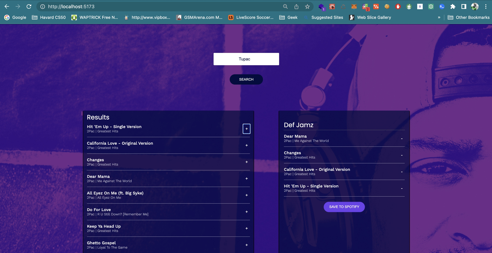

## Project Overview

Jammming is a React app that uses the Spotify API to allow users to search for music tracks, select some of their favorites, and create a playlist in their Spotify account. The app utilizes different Spotify API endpoints, including https://api.spotify.com/v1/search?type=track&q=${term}, https://api.spotify.com/v1/me, https://api.spotify.com/v1/users/${userID}/playlists, and https://api.spotify.com/v1/playlists/${playlist_id}/tracks.

The app is built using both class and functional components to manage the state of the app. It also utilizes a number of React features, including useState to handle the state.

Users can search for tracks by entering a term in the search bar, and the app will return a list of tracks matching that term. Users can then select the tracks they want to add to their playlist, give their playlist a name, and post it to their Spotify account.

### Prerequisites

To get started with the project, you need to have Node.js and npm installed on your computer. If you don't have them installed, please follow the instructions on Node.js website to download and install them.

To get started with this project, follow these steps:

Clone the repository to your local machine.
Navigate to the project directory and install the dependencies by running npm install.
Start the development server by running npm run dev.

## API and Links

1. https://api.spotify.com/v1/search?type=track&q=${term}
2. https://api.spotify.com/v1/me
3. https://api.spotify.com/v1/users/${userID}/playlists
4. https://api.spotify.com/v1/playlists/${playlist_id}/tracks
